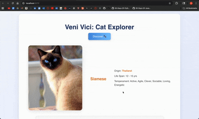

# 🐾 Veni Vici – Cat Explorer

A fun, lightweight React app that lets users discover random cat breeds with images and key facts.  
Each click of the **Discover** button reveals a new cat with its breed name, origin, life span, and temperament.  

Users can click attributes to add them to a **ban list**, filtering out future results that match.  
The ban list appears below the cat info and can be updated by clicking any banned item to remove it.  

---

## 🎥 Demo

---

## 🚀 Features
- [x] Fetches random cat data using `async/await`
- [x] Displays one cat image and three or more attributes per call
- [x] Consistent attributes across all API calls
- [x] Shows only one result at a time
- [x] Randomized API responses on each click
- [x] Clickable attributes add to a **ban list**
- [x] Ban list filters out matching results from future fetches
- [x] Clicking a banned item removes it from the list
- [x] Clean, desktop-friendly UI with centered layout and light colors

---

## 🧠 How It Works
1. Click **Discover** to fetch a random cat breed from the Cat API.  
2. View:
   - 🐈 Image  
   - 🏷️ Breed Name  
   - 🌍 Origin  
   - ⏳ Life Span  
   - 💡 Temperament  
3. Click on an attribute (like *Origin* or *Breed*) to add it to the ban list.  
4. The ban list updates live and prevents future results from showing the banned values.  
5. Click any banned item to remove it and allow it again.

---

## 🧰 Technologies
- **React (Vite)**
- **JavaScript (ES6)**
- **HTML / CSS**
- **The Cat API**

---

## 🔗 API Reference
**Endpoint**  
